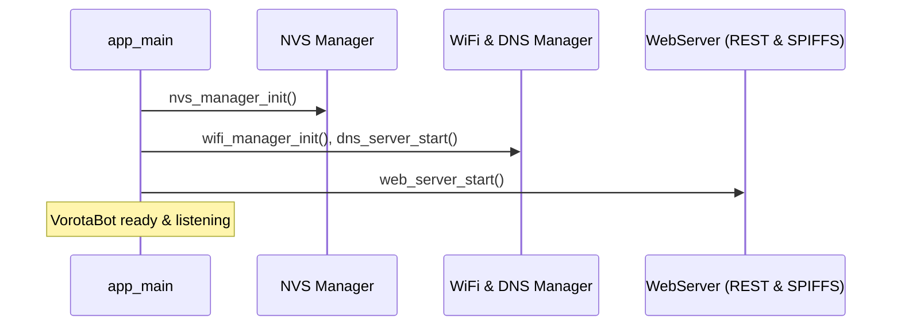

# Architecture & Design Specifications

This document outlines the internal architecture, task model, memory partitioning, networking stack, and data flow of the VorotaBot-ESP32 Dual Gate Controller.

---

## 1. System Initialization & Task Model

When the ESP32 boots (`app_main`), core services initialize in sequence:



### FreeRTOS Tasks Layout

| Task Name | Priority | Stack Size | Core | Function |
| :--- | :--- | :--- | :--- | :--- |
| `main` | 1 | 8192 B | 0 | System initialization and component orchestration |
| `dns_server` | 5 | 4096 B | 0 | Listens on UDP port 53 for captive portal DNS probes |
| `httpd` | 5 | 8192 B | 0 | ESP HTTP daemon serving REST APIs and static SPIFFS assets |
| `gate_pulse_task` | 5 | 3072 B | 0 | Consumes pulse queue to energize relay channels safely |

---

## 2. Flash Partition Layout (`partitions.csv`)

The flash table is optimized for a 4MB SPI Flash chip:

```
+-------------------------------------------------------------------------------+
| NVS (20KB) | OTA Data (8KB) | PHY (4KB) | OTA_0 (1408KB) | OTA_1 (1408KB) | SPIFFS (1152KB) |
+-------------------------------------------------------------------------------+
0x0000       0x9000           0xE000      0x20000          0x180000         0x2E0000
```

- **NVS Partition (`0x9000`, 20KB)**: Stores persistent device credentials (Wi-Fi AP/STA SSID & passwords, settings).
- **OTA Data (`0xE000`, 8KB)**: Manages boot slot selection between `ota_0` and `ota_1`.
- **Dual App Partitions (`ota_0` & `ota_1`, ~1.4MB each)**: Provides fail-safe A/B firmware updates.
- **SPIFFS Storage (`storage`, ~1.15MB)**: Stores pre-gzipped HTML, JS, CSS, and SVG web assets.

---

## 3. Captive Portal & DNS Engine

Mobile devices (iOS, Android, Windows) detect captive portals by attempting HTTP requests to specific probe URLs immediately upon connecting:

1. **Selective DNS Server**: Resolves standard detection hosts (`connectivitycheck.gstatic.com`, `captive.apple.com`, `www.msftconnecttest.com`, and local domain `vorota.local`) to `192.168.4.1`.
2. **HTTP 302 Redirect Handler**: Any probe request (e.g. `/generate_204`, `/canonical.html`, `/hotspot-detect.html`) receives a `302 Found` response redirecting to `http://192.168.4.1/`.
3. **Automatic Web Portal Launch**: The mobile operating system automatically launches the captive portal interface.

---

## 4. Gate Control Subsystem & Relay Isolation (RDC1-2R / ULN2003)

The gate controller component (`gate_controller`) coordinates 4 physical relay channels across two dual-channel RDC1-2R modules:

### Task Model & Queue Architecture
* **`gate_pulse_task`** (Priority 5, 3072 B stack): Consumes `pulse_request_t` items from `s_pulse_queue` (FreeRTOS queue, depth 8).
* **Active-HIGH Pulses**: Pulses target GPIOs to +3.3V for `pulse_duration_ms` (default 400ms), turning on the corresponding ULN2003 Darlington transistor and energizing the 5V relay coil.
* **Safety Interlock**: Rejects incoming triggers if elapsed time since the previous pulse end is below `interlock_delay_ms` (default 1500ms), preventing mechanical binding and electrical chatter.

### Gate Interfaces
1. **Hörmann ProMatic (Garage Door)**:
   * **Terminal 5 (+24V DC)** & **Terminal 20 (0V / GND)**: Power input to DC-DC buck converter stepping down 24V $\to$ 5V to power the Seeed XIAO ESP32-C3 and both relay boards.
   * **Terminal 21**: Full Cycle (Open $\to$ Stop $\to$ Close $\to$ Stop) driven by Module 1 Relay 1 (GPIO 2 / D0).
   * **Terminal 23**: Ventilation / *Teilöffnung* (Partial Open $\to$ Stop $\to$ Close $\to$ Stop) driven by Module 1 Relay 2 (GPIO 3 / D1).
2. **Nice Remote Controller (Driveway Gate)**:
   * **Button 1**: Open Only (Open $\to$ Stop $\to$ Open) driven by Module 2 Relay 1 (GPIO 4 / D2). No-op when fully opened.
   * **Button 2**: Close Only (Close $\to$ Stop $\to$ Close) driven by Module 2 Relay 2 (GPIO 5 / D3). No-op when fully closed.

